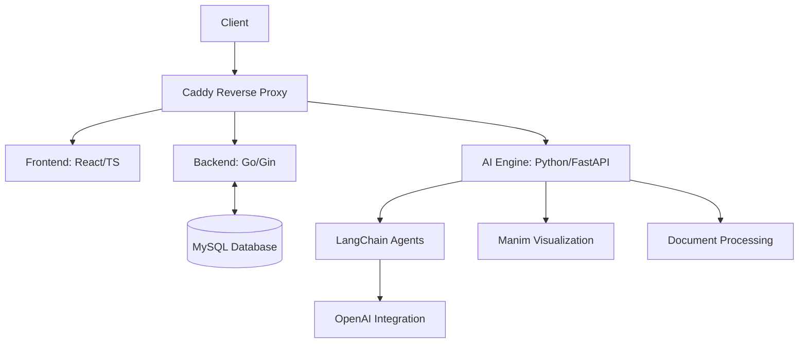

# AI-Driven Online School Platform

[](https://opensource.org/licenses/MIT)


A full-stack AI-powered education platform combining modern web technologies with advanced AI capabilities for personalized learning experiences.

## System Architecture



## Technology Stack

### Core Components
- **Reverse Proxy**: Caddy 2.6+ with automatic HTTPS
- **Frontend**: 
  - React 18+ with TypeScript 5+
  - State Management: Zustand 4+
  - Styling: Tailwind CSS 3.3+ with Headless UI
  - Routing: React Router 6.14+
  
- **Backend (Go)**:
  - Gin Web Framework 1.9+
  - GORM 2.0+ ORM
  - JWT Authentication
  - WebSocket Integration

- **AI Engine (Python)**:
  - FastAPI 0.95+ with WebSockets
  - LangChain 0.0.340+ for AI agent orchestration
  - Manim Community 0.17+ for mathematical visualizations
  - Document Processing: PyMuPDF, python-docx, python-pptx

### AI Capabilities
- **Dean AI Agent**:
  - Dynamic study plan generation
  - Multi-stage conversational interface
  - Document-aware curriculum planning
  - Manim animation script generation

- **Document Processing**:
  - Supported formats: PDF, DOCX, PPTX, CSV
  - Text extraction and semantic analysis
  - Content chunking for AI processing

### Database
- MySQL 8.0+ with InnoDB engine
- Database schema versioning with migrations
- Connection pooling with Go-MySQL-Driver

### DevOps
- Containerization: Docker 20.10+
- CI/CD: GitHub Actions
- Monitoring: Prometheus + Grafana
- Logging: Loki + Promtail

## Key Features

### AI-Powered Learning Flow
1. **Document Upload & Processing**:
   - Secure file validation and storage
   - Multi-format text extraction
   - Content chunking for AI analysis

2. **Dynamic Study Plan Generation**:
   ```python
   async def generate_study_plan(self) -> Dict:
       # Combines document content with pedagogical strategies
       # Generates interactive learning modules with:
       # - Manim animation scripts
       # - Conversational prompts
       # - Assessment checkpoints
   ```

3. **Real-Time AI Interaction**:
   - WebSocket-based communication
   - Context-aware conversation management
   - Progressive content delivery

### Security Features
- JWT-based authentication
- File validation:
  ```python
  def fetch_uploaded_files(self) -> str:
      # Security checks:
      # - User-specific file naming
      # - Path validation
      # - File existence verification
  ```
- Rate limiting and request validation
- HTTPS-only communication

## Getting Started

### Prerequisites
- Node.js 18.12+ (LTS)
- Go 1.20+
- Python 3.11+
- MySQL 8.0+
- Redis 7.0+ (for caching)

### Installation

#### AI Engine Setup
```bash
cd backend/ai_engine
python -m venv venv
source venv/bin/activate
pip install -r requirements.txt

# Configure environment
cp config/config.example.json config/config.json
# Add your OpenAI API key
```

#### Go Backend Setup
```bash
cd backend
go mod download

# Configure environment
cp .env.example .env
# Update database credentials

# Run migrations
go run cmd/migrate/main.go
```

### Running the System
```bash
# Start AI Engine
uvicorn main:app --reload --port 8000

# Start Go Backend
go run main.go

# Start Frontend
cd frontend
npm install
npm run dev
```

## API Documentation

### AI Engine Endpoints
- `WS /ai/dean_ai/{token}?material={filename}`
  - Real-time study plan generation
  - Payload format:
  ```json
  {
    "manim_script": "Python code for visualization",
    "message": "Natural language explanation",
    "notes": "Key learning points"
  }
  ```

### Core Endpoints
- Authentication: JWT-based
- File Management:
  - POST /api/materials
  - GET /api/materials/{id}
- Course Management:
  - POST /api/courses
  - GET /api/courses/{id}/study-plan

## Development Guidelines

### Branch Strategy
- `main`: Production-ready code
- `develop`: Integration branch
- Feature branches: `feature/[description]`

### Testing
- Go: Native testing package
- Python: pytest with 90%+ coverage
- Frontend: Jest + React Testing Library

## License
No current license, since it's not an open source project.

## Roadmap

### Q1-2 2025
- [ ] Multi-modal AI integration (vision/audio)
- [ ] Real-time collaboration features
- [ ] Adaptive assessment engine

### Q3-4 2025
- [ ] Mobile app integration
- [ ] AI teaching assistant marketplace
- [ ] Blockchain credential verification
```

1. System architecture visualization
2. Detailed technology specifications
3. Key implementation details from the code
4. Clear setup instructions
5. API documentation
6. Development guidelines
7. Future roadmap
